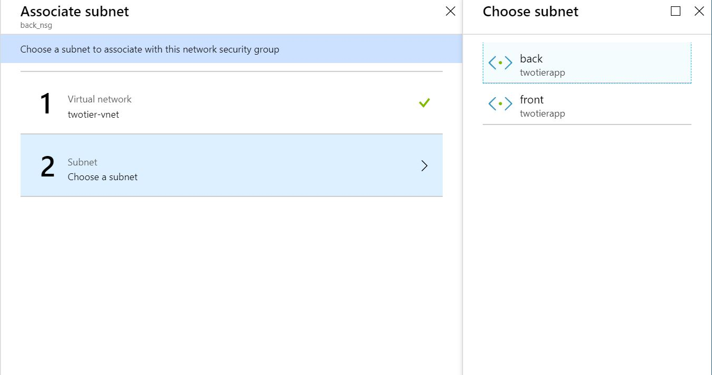
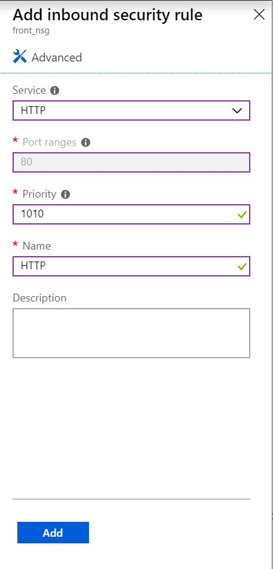

# Summary

We will use [Virtual Machines](https://azure.microsoft.com/en-us/services/virtual-machines/) and the common components associated with it to set up a simple 2-tier application as shown below.

This particular setup is not optimal for production use. I wanted this to be a way of getting used to Azure IaaS services and the portal, especially for people who are just getting started with Azure and maybe have other cloud provider experience.

# Instructions

**_Warning_** - The instructions were made and tested on Oct. 2018. Please be aware that Azure changes very fast so these instructions may have become obsolete.

I strongly recommend you clean up (delete) all the resources you create here once you are done with the exercise, unless you intend to experiment more on your own. As with any Cloud service, almost all resources have a cost, even if they are "stopped." You can follow [Task6](#Task-6---Cleaning-up-the-resources) for instructions on deleting resources.

## Assumptions

You have a working Azure subscription and you are logged into the Azure portal.

If you do not have an Azure account, you can create a free account which comes with some free credits you can use for 1 month. [Azure Account](https://azure.microsoft.com/en-us/free/)

This exercise will only cost you a few dollars as long as you delete the resources.

---

## Task 0 - Explore the Portal

When you login to the Azure portal, the first thing you should see is the Dashboard. The dashboard is a powerful tool, customizable to your needs. There are many "tiles" you can use, ranging from navigation to your resources to graphs to monitor your service performance.

On the top, you have a menu bar with a bunch of features. You will find the portal settings, notifications, Cloudshell, etc.

On the left hand side, you should see a navigation menu sidebar. In addition to creating resources and listing all the services, you can pin your most used services using the "Favorites" feature. To do so, click on "All services" and click on the star icon next to the Azure service you want to pin.

---

## Task 1 - Creating a [Resource Group](https://docs.microsoft.com/en-us/azure/azure-resource-manager/resource-group-overview#resource-groups)

We will start off the exercise by creating a Resource Group to store all the resources we create in this exercise.

### Step 1

Click on "Create a resource" in the sidebar. 

### Step 2

A new blade will popup with a search bar on top. Enter "Resource Group" and press enter.

### Step 3

From the list of search results, click on "Resource Group."

A new blade with a description of the resource should be displayed. Go ahead and click "Create"

### Step 4

A new blade to enter parameters should popup. Enter the following parameters

| Parameter | Value |
| --------- | ----- |
| Name | twotierapp |
| Subscription | Choose the subscription you want to use |
| Location | Select a location, preferably the closest region to you. (Some subscriptions may have limitations on which location you can set particular resources.) |

Make sure everything is entered correctly and validated. To proceed, click "Create"

### Step 5

Navigate to the newly created resource group. There are multiple ways of achieving this.

One way is to use the notification that pops up when the resource is ready. This is not a reliable way because notifications come and go.

Another way is to use the sidebar and click on "Resource Group." (Assuming you Resource Group in the favorites. If not, you can go to "All Services" and find "Resource Group" there) This shows you a list of all the Resource Groups.

---

## Task 2 - Creating a [Virtual Network](https://docs.microsoft.com/en-us/azure/virtual-network/)

Virtual Networks (VNet), as the name states, creates a virtual network within Azure. This allows you to isolate a network segment for secure communication amongst Azure resources like VMs, other VNets, and on-premises networks.

We will create a VNet with 2 subnets, one subnet for the frontend VM and one for the backend VM.

### Step 1
Click on "Create a resource" in the sidebar. 

### Step 2

A new blade will popup with a search bar on top. Enter "Virtual Network" and press enter.

### Step 3

From the list of search results, click on "Virtual Network."

A new blade with a description of the resource should be displayed.

Under "Select a deployment model," choose "Resource Manager" if not already chosen. Azure Resource Manager (ARM) is the newer deployment model. Unless you have reasons to choose otherwise, you should stick with ARM.

Go ahead and click "Create."

### Step 4

A new blade to enter parameters should popup. Enter the following parameters

| Parameter | Value |
| --------- | ----- |
| Name | twotier-vnet |
| Address space | 10.0.0.0/24 |
| Subscription | your subscription |
| Resource group | twotierapp |
| Location | Choose the location you used for the resource group |
| **Subnet** | |
| Name | front |
| Address range | 10.0.0.0/27 |
| DDoS protection | Basic |
| Service endpoints | disabled |
| Firewall | disabled |
 

To proceed, click "Create."

This creates a new VNet and a new subnet.

## Step 5

Go to the newly created VNet and add a new subnet for the backend.

From the sidebar, click on "Resource Group" and go to the Resource Group you created ("twotierapp") the new VNet in. From the list of resources in the Resource Group, click on the new VNet ("twotier-vnet").

Click on the "Subnets" in the VNet menu.

You should see a list of the subnets associated with the VNet. You should see 1 subnet called "front," which we created with the VNet.

Click on the "+ Subnet" towards the top of the blade to add a new subnet.

A new blade to enter parameters should popup. Enter the following parameters

| Parameter | Value |
| --------- | ----- |
| Name | back |
| Address range | 10.0.0.32/27 |
| Network security group | none |
| Route table | none |
| Service endpoints | 0 selected |
| Subnet delegation | None |

To proceed, click "OK."

---

## Task 3 - Setting [Network Security Groups](https://docs.microsoft.com/en-us/azure/virtual-network/security-overview)

To have control over the traffic going in and out of the subnet, we will use a Network Security Group (NSG). NSGs are IP and port based security rules you can associate with many Azure resources, including VNets, Subnets, and Virtual Machines.

We are going to add NSGs to the 2 subnets we created. This allows us to control the inbound and outbound traffic to the resources located in each subnet.

### Step 1

From the sidebar, click on "Create a Resource" and search for "Network Security Group."

### Step 2

A new blade to enter parameters should popup. Enter the following parameters

| Parameter | Value |
| --------- | ----- |
| Name | front_nsg |
| Subscription | your subscription |
| Resource group | twotierapp |
| Location | Choose the location you used for the resource group |

### Step 3

Repeat Step 1 and 2, using the following parameters.

| Parameter | Value |
| --------- | ----- |
| Name | back_nsg |
| Subscription | your subscription |
| Resource group | twotierapp |
| Location | Choose the location you used for the resource group |

### Step 4

Associating NSGs to subnets.

Find the 2 NSGs you created in the previous steps by drilling down into the resource group. Click on "back_nsg."

In the NSG menu, click on "Subnets."

In the new view, click on "Associate."

In the "Associate subnet" blade, select the Virtual network ("twotier-vnet") and subnet ("back").

Click on "OK" at the bottom of the blade.

### Step 5

Repeat Step 4, but associate the "front_nsg" to the "front" subnet.

### Step 6

By default, NSGs are set to only allow traffic from within the VNet and from a Load Balancer. We want the frontend subnet to allow traffic from HTTP(S) and RDP so we have to update the Inbound Security Rules of the frontend NSG.

Drill into the resource group and click on "front_nsg." In the Network Security Group menu, click on "Inbound Security Rule." You should see a list of the current Security rules.

Click on "Add."

Use the following parameters for creating a new inbound security rule.

If you have the "Basic" displayed on top, go ahead and click on that. That will change the form to the Basic version. (The other is Advanced, where you can choose more detailed settings for the security rule)

| Parameter | Value |
| --------- | ----- |
| Service | RDP |
| Port Ranges | 3389 (Should be filled automatically) |
| Priority | 1000 |
| Name | RDP |

Click "Add."

Similarly, add a rule for HTTP and HTTPS. Choose values accordingly; following are examples just in case.

| Parameter | Value |
| --------- | ----- |
| Service | HTTP |
| Port Ranges | 80 (Should be filled automatically) |
| Priority | 1010 |
| Name | HTTP |

| Parameter | Value |
| --------- | ----- |
| Service | HTTPS |
| Port Ranges | 443 (Should be filled automatically) |
| Priority | 1020 |
| Name | HTTPS |

The list of inbound security rules for your "front_nsg" should look something similar to the image below.

You get a warning for the RDP rule; for production environments, you would want to be careful about allowing traffic to common ports, especially ports like RDP (3389) and SSH (22). They can easily be targeted for attacks. We use these ports for the sake of simplicity.

---

## Task 4 - Creating the first [Virtual Machine](https://azure.microsoft.com/en-us/services/virtual-machines/)

As mentioned in the [Summary](#Summary), we will be creating a total of 2 Virtual Machines (VM). Just to mix things up, we will create a Windows VM and Linux (CentOS) VM.

### Step 1

From the sidebar, click on "Create a Resource" and search for "Windows 10." Virtual machines do not come as "Virtual machines" but as images, therefore we search for the image name here.

### Step 2

A new blade to enter parameters should popup. Enter the following parameters

| Parameter | Value |
| --------- | ----- |
| Subscription | your subscription |
| Resource group | twotierapp |
| Virtual machine name | winvm |
| Region | Choose the location you used for the resource group |
| Availability options | No infrastructure redundancy required |
| Size | Standard B1s |
| Username | demouser |
| Password | *Some password you can remember* |
| Confirm Password | *Same as above* |
| Public inbound ports | None |
| Already have Windows license | No |

You may want to filter the list of VM sizes if you can't find the one you are looking for.

Click "Next: Disks" to proceed. (For the exercise sake, we will click through all tabs. If you are not going to change any parameters, you can choose "Review + Create" to skip the rest of the tabs)

### Step 3

Leave values as is. We will use the default values.

Click on "Next: Networking."

### Step 4

A next tab to enter parameters should popup. Enter the following parameters

| Parameter | Value |
| --------- | ----- |
| Virtual Network | twotier-vnet |
| Subnet | front |
| Public IP | none |
| Network security group | None |
| Configure network security group | None |
| Accelerated networking | None |

Click on "Next: Management."

### Step 5

Turn all the features off. Either way, it does not affect the exercise itself.

Click on "Next: Guest config."

### Step 6

Click on "Next: Tags."

### Step 7

Click on "Next: Review + Create."

### Step 8

Azure will do some validations and display the summary of what is being created.

Click "Create" once the button is enabled.

It will take a couple of minutes for the VM to be created.

---

## Task 5 - Creating the second VM

We need to create the second VM.
Repeat Task 4, but make sure you create the VM in the "back" subnet. That would be, choosing the "back" subnet for Task4 Step4.

---

## Task 6 - Creating a 

Azure Load Balancer is a L4 load balancer. We will use the Load Balancer to direct the HTTP traffic from the internet to the frontend VM. (The instructions only opens the HTTP traffic. You would have to add a load balancing rule for port 443 to enable HTTPS traffic.)

We will also use the load balancer to create an Inbound NAT to redirect RDP traffic to the frontend VM.

### Step 1

From the sidebar, click on "Create a Resource" and search for "Load Balancer."

### Step 2

A new blade to enter parameters should popup. Enter the following parameters

| Parameter | Value |
| --------- | ----- |
| Name | front-lb |
| Type | Public |
| SKU | Basic |
| Public IP address | Create new |
| (text box below) | front-lb-ip |
| Configure public IP address - SKU - Assignment | Dynamic |
| Add a public IPv6 address | unchecked | 
| Subscription | Your subscription |
| Resource group| twotierapp |
| Location | Choose the location you used for the resource group |

Click "Create."

### Step 3

Navigate to the newly created load balancer. From the Load Balancer menu, check the "Backend pools" and click on the "Add" button.

A new blade to enter parameters should popup. Enter the following parameters

| Parameter | Value |
| --------- | ----- |
| Name | front-vm |
| IP Version | IPv4 |
| Associated to | Single virtual machine |
| Target virtual machine | winvm |
| (Click on "+Add a target network IP configuration") | |
| Network IP Configuration | ipconfig1 |

Click on "OK."

### Step 4

Create a health probe. From the Load Balancer menu, check the "Health probes" and click on the "Add" button.

A new blade to enter parameters should popup. Enter the following parameters

| Parameter | Value |
| --------- | ----- |
| Name | healthprobe |
| Protocol | TCP |
| Port | 80 |
| Interval | 5 |
| Unhealthy threshold | 2 |

Click "OK."

### Step 5

Create a load balancing rule. From the Load Balancer menu, check the "Load balancing rules" and click on the "Add" button.

A new blade to enter parameters should popup. Enter the following parameters

| Parameter | Value |
| --------- | ----- |
| Name | frontvm |
| IP Version | IPv4 |
| Frontend IP Address | LoadBalancerFrontEnd |
| Protocol | TCP |
| Port | 80 |
| Backend Port | 80 |
| Backend pool | front-vm (1 virtual machine) |
| Health probe | healthprobe (TCP:80) |
| Session persistence | None |
| Idle timeout | 4 |
| Floating IP | Disabled |

Click "OK."

### Step 6

Create an Inbound NAT. From the Load Balancer menu, check the "Inbound NAT" and click on the "Add" button.

A new blade to enter parameters should popup. Enter the following parameters

| Parameter | Value |
| --------- | ----- |
| Name | frontend-rdp |
| Frontend IP address | LoadBalancerFrontEnd |
| Service | RDP |
| Protocol | TCP |
| Port | 3389 |
| Network IP configuration | ipconfig1 |
| Port mapping | Default |

Click "OK."

### Step 7

Go to the Overview of the Load Balancer. Check the public IP Address of the Load Balancer.

---

## Task 7 - Verifying things work

We have set up all the components of the architecture, we can start testing the connections to make sure things are set up properly.

We will start up a web server on the frontend VM. This will open up the 80 port. RDP (port 3389) should be opened by default.

### Step 1

RDP into the frontend VM using the IP address of the load balancer and 
the login credentials you chose when creating the VM.

### Step 2

Enable IIS on the VM. Go to Control Panels > Programs > Programs and Features > Turn Windows features on and off.

Check *Internet Information Services*. This should set up the web server on your Windows 10 VM.

Try opening up a web browser within the VM and access http://localhost/. You should see the default IIS page.

Now, try accessing the web page from the web browser on your PC. Use the IP address of the load balancer.

You should see the same IIS start up page if correctly set up.

### Step 3

Go back the RDP'ed frontend VM. We will RDP to the backend VM from the frontend VM.

You can retrieve the private IP from the Azure portal. Go to the VM and look under "Networking." If you have the same setup as the exercise, you should have an IP in the 10.0.0.32/27 range.

If you were able to successfully RDP, that means the set up is complete.

---

## Task 8 - Cleaning up the resources

When you are done with the whole exercise and any experimenting you want to do, you should delete the resources to minimize the cost. You should have created all resources in the same resource group, therefore you can simply delete the resource group to delete everything.

Go to the resource group you created, and click on "Delete resource group." You need to type in the Resource group name to confirm your delete.

Deleting the resources may take some time. You do not have to stay on the portal for the job to complete. However, there are times when resources cannot be deleted under some conditions so you would want to check back later just incase.

---

## Troubleshooting

TBC